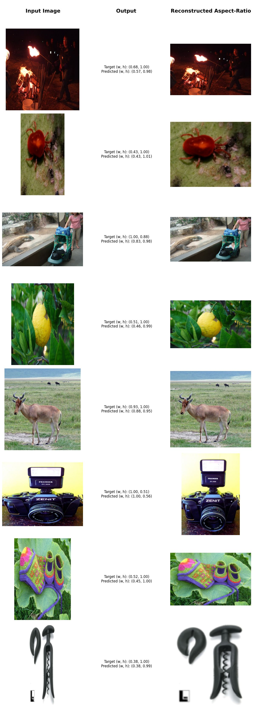

# Deep Image Squish Predictor

I recently delved into self-supervised deep learning and wanted to try out a fun and practical project using this new approach. My idea was to create a model that can figure out how much an image has been squished or distorted. While this might sound niche, it's a neat way to see self-supervised learning in action, and it could be useful in various tasks where understanding image distortions matters.

## Methodology

### Dataset

For this project, I used the [ImageNet-1000 dataset](https://www.kaggle.com/datasets/ifigotin/imagenetmini-1000), which contains approximately 32,000 images across 1,000 classes. This diverse dataset provided a solid foundation for training and evaluating the model.

### Input Processing

To train the model effectively, images were transformed in several stages:
1. **Random Crop**: Images were cropped randomly with an aspect ratio not greater than 3:1 or 1:3. This approach helps avoid biases introduced by predominantly square images.
2. **Random Squish**: The cropped images were then squished with a random ratio, adjusting either width or height. The images were resized and padded to fit a fixed size of 256x256 pixels.

### Output Format

The model outputs two values representing the squish ratios:
- Width Squish Ratio
- Height Squish Ratio

The model's output values are not constrained to a specific range, and the final layer uses a linear activation function. The target value is a pair `(wsr, hsr)`, where one value is always 1.00 and the other falls within the range `(0.00, 1.00]`. For example, a target of `(0.50, 1.00)` indicates that the image's width has been reduced to half of its original aspect ratio.

### Self-Supervised Learning

To avoid requiring labeled data, a self-supervised learning approach was employed:
- **Transformation-based Supervision**: The squish ratio was directly derived from the transformations applied to the images, with no need for manual labeling.

### Random Cropping Justification

Random cropping was used to ensure that the model did not learn to exploit padded zero pixels (from resizing) as a signal for squish detection. This technique promotes learning from diverse image contexts and helps the model generalize better across different image types and aspect ratios.

### Fine-Tuning Approach

The model was fine-tuned using EfficientNet-B4 as a backbone, with the final layer adjusted to output two values corresponding to the squish ratios. The training involved:
- **Optimizer**: Adam
- **Loss Function**: Mean Squared Error (MSE)
- **Learning Rate**: Initial: 1e-3

The model was trained for 3 epochs, with a learning rate scheduler that reduces the learning rate by the factor of `0.1` per epoch.

This approach was sufficient for the task, as the model showed good performance after these 3 epochs.

### Number of Parameters

The total number of trainable parameters in the model is approximately 19M. This includes the parameters of the EfficientNet-B4 backbone and the added fully connected layers.

## Results

### Next Steps

1. **Expand Dataset**: Incorporate a more extensive and varied dataset to improve model robustness.
2. **Optimization**: Explore using smaller models than EfficientNet-B4 to see if they can provide comparable performance with reduced computational cost.
3. **Real-World Testing**: Deploy the model in real-world applications to evaluate its practical effectiveness and robustness.
